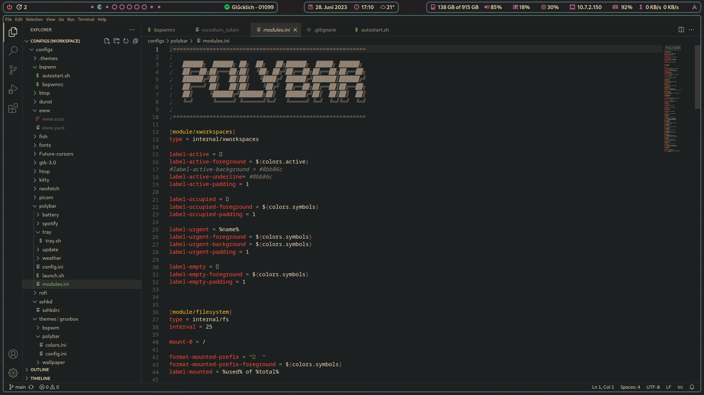
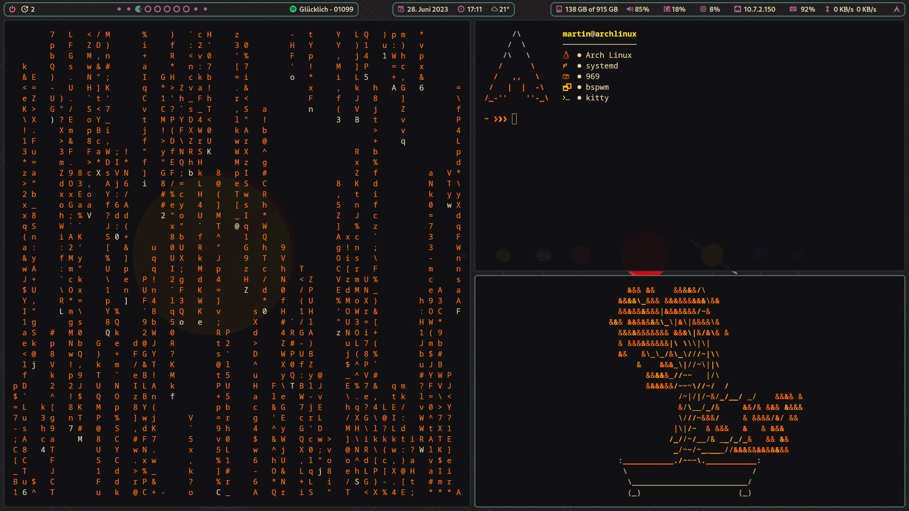

Intended for Arch Linux only!
But... You can build all the required dependencies from source and use the 'apply.sh' script (not existing yet) to just apply the look&feel of the theme.  

Git is needed for the script to pull from github

Change the location of the weather-module in polybar 

git clone https://github.com/RoccoRakete/bspwm-gruvbox.git && chmod +X ~/bspwm-gruvbox/install.sh && bash ~/bspwm-gruvbox/install.sh

--------- Screenshots -----------

Wallpaper

Firefox

VSCodium

Kitty